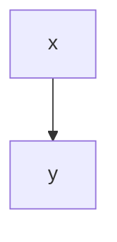

# コードスパンに包まれた引用マーカー（Issue #527）

雛形は `<!--` で開いて書く

### ACE

Agentic Context Engineering

```mermaid
graph TD
    A[x] --> B[y]
```

### SSOT

単一の情報源

`<!-- 閉じないスパンの中のマーカー --> 続き

`a` <!-- x --> `<!--`
