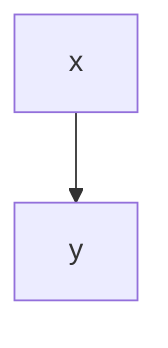

# 散文の閉じ忘れコメントと後続フェンス内の矢印（Issue #706 の現状固定）

<!-- TODO: 閉じ忘れコメント

ここから下はフェンス内の矢印までコメント本体として扱われ、走査から落ちる。
CommonMark の HTML ブロック（開始マーカーで開き、閉じマーカーを含む行で閉じ、
その間はフェンスを解釈しない）と同じ判定で、narrowing 1 の帰結。

矢印より後ろの本文は残る
